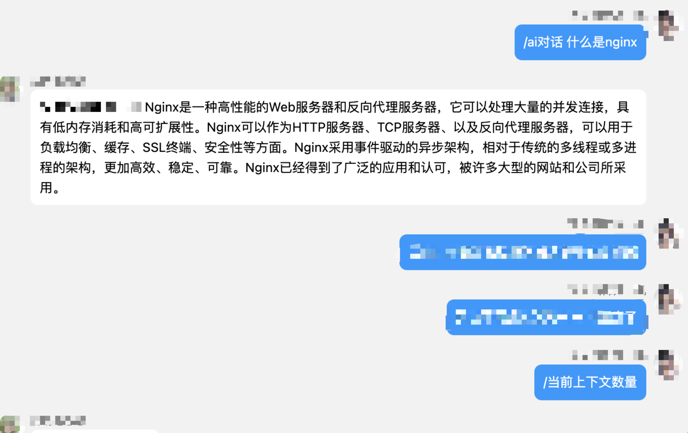
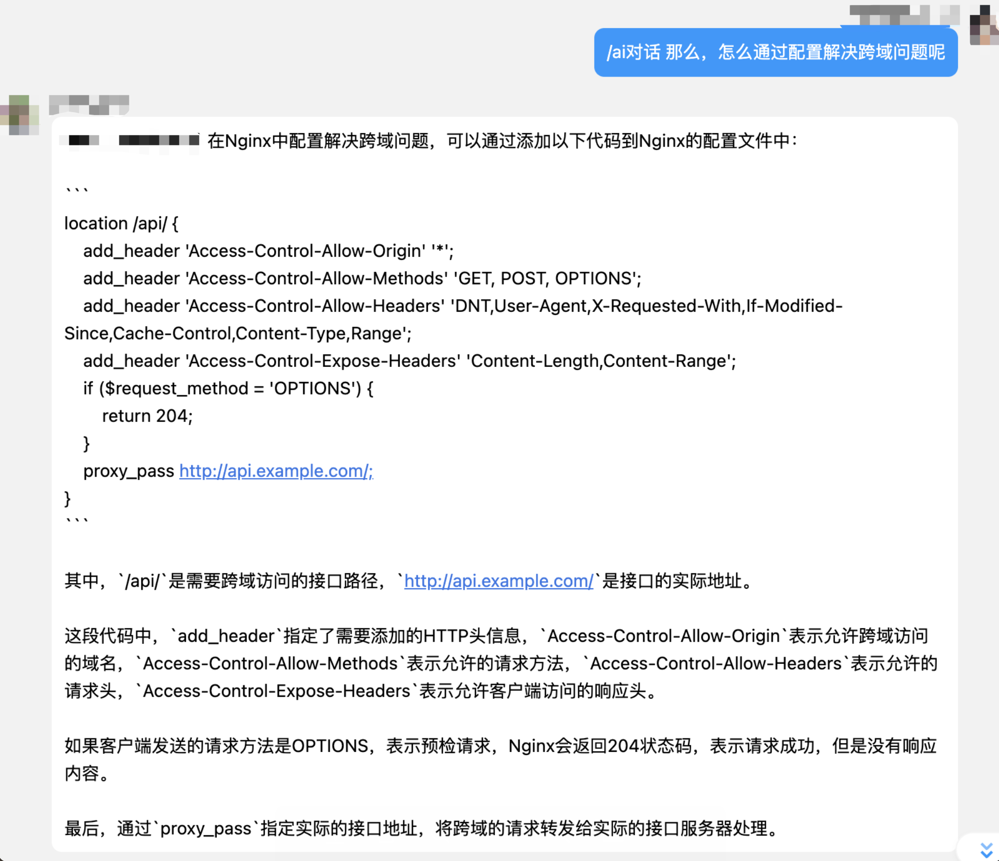

# 白嫖GPT-3.5-turbo
通过调用公开版网站的API接口，实现和gpt-3.5-turbo模型的上下文关联对话。\
该模块实现了与模型的上下文关联对话，并且在请求失败时自动清空上下文。\
该模块必须做成后端服务，否则上下文的持久化需要用到数据库等其它持久化工具辅助。 \
而当你使用了后端服务，只要服务不停止，上下文就可以保留。

## 已增加前端页面
前端代码仓库：[Bai-Piao-GPT-WebUI](https://github.com/Vincent-the-gamer/Bai-Piao-GPT-WebUI)

请大家自行拉取前后端去部署了，我不想公开服务器的使用了，以免被恶意刷流量。

## 开发日志
[查看开发日志](./devLog.md)

## 效果预览
这是我配合我的QQ机器人进行调用的效果

## 如何本地运行代码
1. 拉取项目
~~~shell
git clone https://github.com/Vincent-the-gamer/Bai-Piao-GPT-3.5-Turbo.git
~~~

2. 安装依赖
~~~shell
pip install -r requirements.txt
或
手动安装flask, requests库
~~~

3. 运行代码，默认在本地的2333端口开启服务。

## 主要功能
我们的根地址是： `http://服务所在ip地址:2333` \
我编写的接口如下： \
"/": **post方式**，返回对话结果文本，自动将你的提问和AI的回答写入上下文数组 \
"/clearContext": **get方式**，清空当前上下文，返回清空后的信息 \
"/showContextCount": **get方式**，获得当前上下文长度信息

## 如何调用
默认采用2333端口，使用post方式，使用json传参

举例：\
本地运行时：\
对http://localhost:2333发起请求的请求体如下
~~~json
{
  "content": "前端就是在前面端菜的意思吗?"
}
~~~
使用post方式来发送请求，一般来说，不需要刻意设置请求头，如果你担心，那么： \
把Content-Type设置成application/json就好。

除此之外的两个接口都是get请求，并且不需要携带任何参数，所以就不再多做说明。
